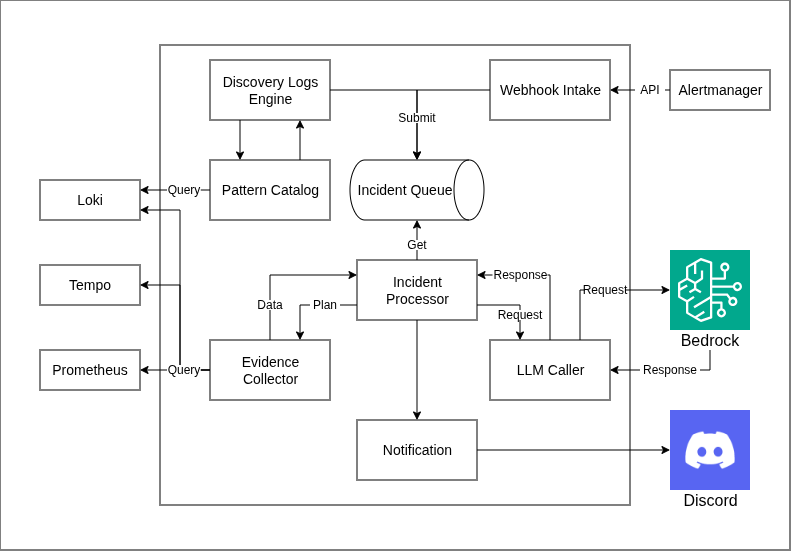
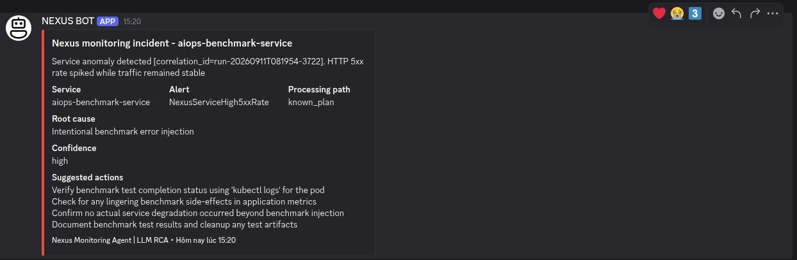

# Nexus Monitoring Agent

Nexus Monitoring Agent is a AIOps Agent that detect incidents, analyzes root causes and sends action suggestions to notification.

## Core Capabilities

- **Incident intake**: Triggered by Alertmanager and also detects anomalies application error patterns internally.
- **Context-aware RCA**: Collects relevant telemetry and Kubernetes context before analyzing an incident.
- **Alert to notifications**: Sends an incident summary, confidence level and investigation steps to notification like Discord.
- **Saving cost**: Reuses validated approaches for recurring or obvious incidents to avoid unnecessary LLM requests.
- **Safety**: allow read-only queries and keeps credentials outside source code.

## Architecture


<i>High-level architecture</i>
<br>
<br>

The agent receives signals from the monitoring stack, collects context needed to understand the affected service, produces an RCA through an LLM provider when needed and delivers the outcome to the notification.

## Tech Stack

| Area | Technology |
| --- | --- |
| Language | Go |
| AI inference | Amazon Bedrock |
| Monitoring | Prometheus, Alertmanager, Loki, Tempo and OpenTelemetry |
| Runtime | Docker, Kubernetes and Amazon EKS |
| Delivery | GitHub Actions and Argo CD |
| Notifications | Discord |

## Demo


<i>Example incident notification delivered to Discord</i>
<br>

## Deployment

The agent runs as a container in Amazon EKS. Its Kubernetes configuration,
runtime identity, secrets and deployment lifecycle are managed by the
[`nexus-gitops`](https://github.com/nguyentin05/nexus-gitops) repository.

Required runtime integrations are supplied by the platform:

- Monitoring and telemetry services
- An LLM inference provider
- Discord webhook delivery
- Kubernetes identity and access controls

## Repository Structure

```text
cmd/agent/          Application entry point
internal/agent/     Agent implementation
docs/               Architecture and demo images
.github/workflows/  CI/CD workflows
```
